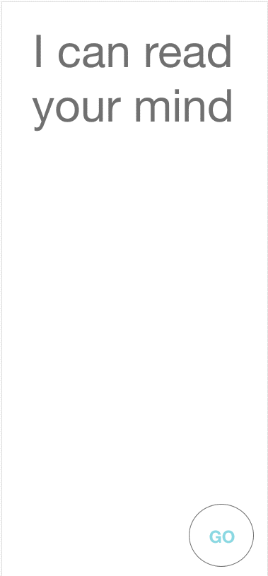

# **Mind Reader Project**

- The focus of this project is to learn about state management in JavaScript. The application will prompt the user to pick a number and complete a few simple math calculations to end up with a final number that will correspond with the same symbol picked by the app.

  

  

[Take a look at the project. . .](#)
