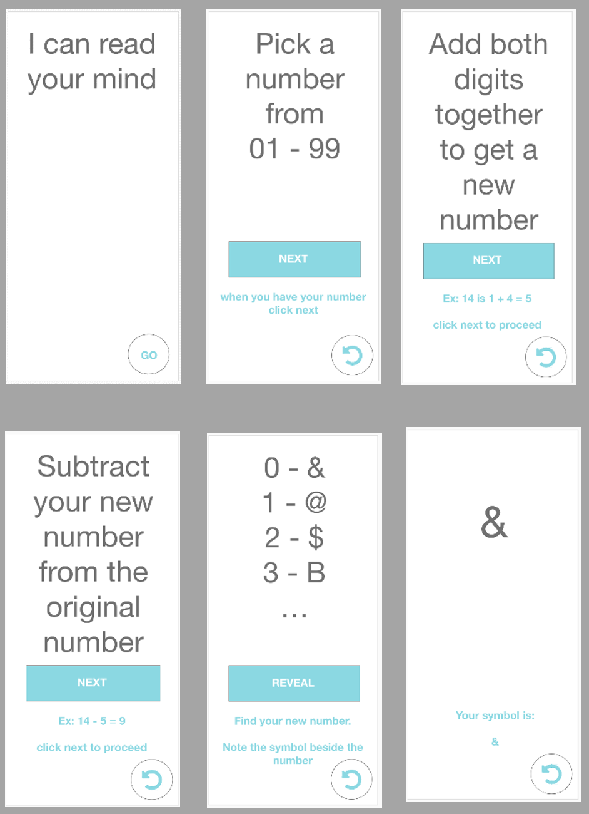

# **Mind Reader App**

## **Wireframe**:



<br/><br/>

## **Important Items to Remember**:

- Create a single index.html page.

- Update page views with JavaScript state management.

- Do not use the same symbol multiple times.

- Use scroll feature on page containing symbol and number combination.

- When user presses reset it should go back to the first page.

<br/><br/>

<hr>

## **Objects**:

<br/>

- ### **View**

  - Text

    - headingText: Provides instructions to the user on how to play, navigate, find their answer, and reveals the answer. Displayed on all views.

    - helperText: Provides helpful tips to the user on on how to proceed through the application. Hidden on first view.

  - Buttons

    - navButton: Used to change state.

    - nextButton: Used to change state.

  - Scroll Feature

    - Bootstrap:

<br/><br/>

<hr>

## **Views**:

<br/>

- ### **View 0**:

  // Properties

  - headingText = visible,
  - nextButton = hidden,
  - helperText = hidden,
  - navButton = visible, // Button Text "GO"
    - navButton -> click changes state view++

<br/>

- ### **View 1 - View 3**:
  // Properties
  - headingText = visible,
  - nextButton = visible, // Button Text "NEXT"
    - nextButton -> click changes state view++
  - helperText = visible,
  - navButton = visible, // Button Text Icon
    - navButton -> click resets state view = 0;

<br/>

- ### **View 4**:
  // Properties
  - headingText = visible,
    - Enable scroll feature, Bootstrap
  - nextButton = visible, // Button Text "REVEAL"
    - nextButton -> click changes state view++
  - helperText = visible,
  - navButton = visible, // Button Text Icon
    - navButton -> click resets state view = 0;

<br/>

- ### **View 6**:
  // Properties
  - headingText = visible,
  - nextButton = hidden,
  - helperText = visible,
  - navButton = visible, // Button Text Icon
    - navButton -> click resets state view = 0;

<br/><br/>

<hr>

```
START

INIT
    Create click handlers navButton and nextButton
    Create variable setting view to zero
    Create empty variable to hold a result symbol
    Create array containing symbols

FUNCTIONS

    randomSymbol -> Loops through the symbol array, but needs to pick specific symbols based on the rule of 9 (n % 9 === 0). Important, need to make sure not to use same symbol twice.

    updateState -> view++
      updateView

    resetView -> resets State based on the current view.
      IF view === 0 THEN view++;
      ELSE view = 0
      updateView

    updateView -> Updates view based on current state

END

```
